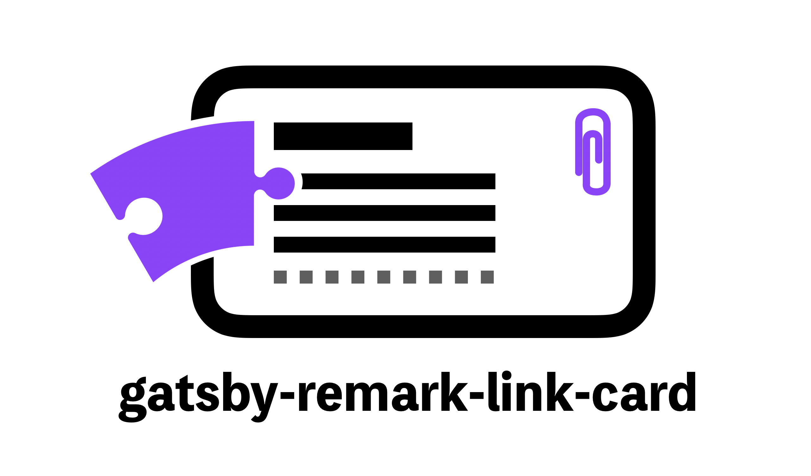

<div align="center">
  
</div>

Gatsby Remark plugin to embed card about link.

> 👀 You can preview the description of the link!

<p>
  
  <a href="https://twitter.com/JbeeLjyhanll">
    
  </a>
</p>

## 🗂 Use Case

- [gatsby-starter-bee](https://github.com/JaeYeopHan/gatsby-starter-bee)

## 🚚 Install

```
$ npm install --save gatsby-remark-link-card
# or
$ yarn add gatsby-remark-link-card
```

## 🚀 How to use

👉 This plugin requires `gatsby-transformer-remark`.

```js
// In your gatsby-config.js
plugins: [
  {
    resolve: `gatsby-transformer-remark`,
    options: {
      plugins: [
        {
          resolve: `gatsby-remark-link-card`,
          options: {
            //...
          }
        }
      ]
    }
  }
];
```

## ⚙ Options

| Property       | Type                                  | Default  | Description                                                |
| -------------- | ------------------------------------- | -------- | ---------------------------------------------------------- |
| `margin`       | `number`                              | `0`      | |

## Author

👤 **JaeYeopHan (Jbee)**

- Github: [@JaeYeopHan](https://github.com/JaeYeopHan)
- Twitter: [@JbeeLjyhanll](https://twitter.com/JbeeLjyhanll)

## Inspiration

[gatsby-remark-embedder](https://github.com/MichaelDeBoey/gatsby-remark-embedder)

## Show your support

Give a ⭐️ if this project helped you!

<div align="center">

<sub><sup>Written by <a href="https://github.com/JaeYeopHan">@Jbee</a></sup></sub><small>✌</small>

</div>
